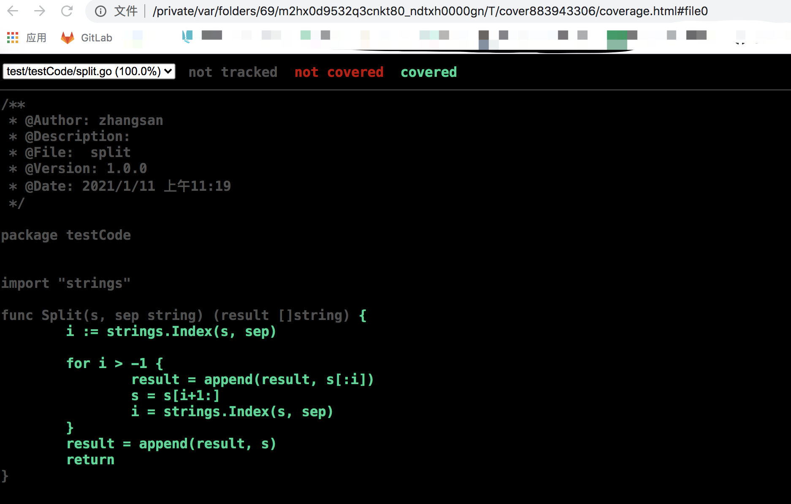
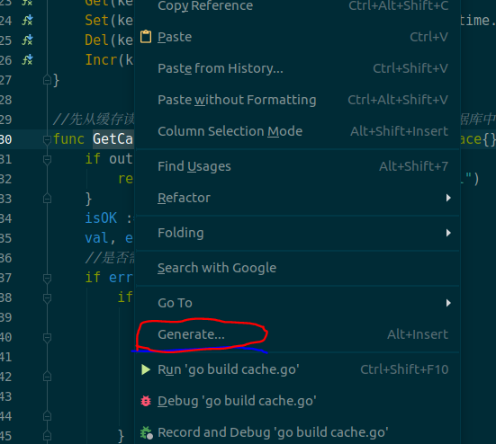
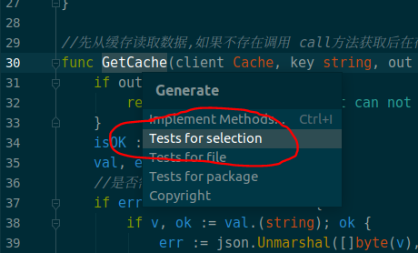

# 1、测试类型

在`*_test.go`文件中有三种类型的函数，单元测试函数、基准测试函数和示例函数。

| 类型     | 格式                  | 作用                           |
| :------- | :-------------------- | :----------------------------- |
| 测试函数 | 函数名前缀为Test      | 测试程序的一些逻辑行为是否正确 |
| 基准函数 | 函数名前缀为Benchmark | 测试函数的性能                 |
| 示例函数 | 函数名前缀为Example   | 为文档提供示例文档             |


# 2、测试函数

## 一、测试函数的格式

每个测试函数必须导入testing包，测试函数的基本格式如下：

```go
func TestName(t *testing.T){
    // ...
}
```

<font color=green size=5x>**测试函数的名字必须以Test开头**，可选函数的后缀名必须以`大写字母开头`</font>

```go
func TestAdd(t *testing.T){ ... }
func TestSum(t *testing.T){ ... }
func TestLog(t *testing.T){ ... }
```


<font color=red size=5x>**其中参数t用于报告测试失败和附加的日志信息**，testing.T拥有的方法如下</font>

```go
func (c *T) Error(args ...interface{})
func (c *T) Errorf(format string, args ...interface{})
func (c *T) Fail()
func (c *T) FailNow()
func (c *T) Failed() bool
func (c *T) Fatal(args ...interface{})
func (c *T) Fatalf(format string, args ...interface{})
func (c *T) Log(args ...interface{})
func (c *T) Logf(format string, args ...interface{})
func (c *T) Name() string
func (t *T) Parallel()
func (t *T) Run(name string, f func(t *T)) bool
func (c *T) Skip(args ...interface{})
func (c *T) SkipNow()
func (c *T) Skipf(format string, args ...interface{})
func (c *T) Skipped() bool
```

## 二、示例

```
tree        
.
├── split.go
└── split_test.go

0 directories, 2 files
```

Split.go

```go
/**
 * @Author: zhangsan
 * @Description:
 * @File:  split
 * @Version: 1.0.0
 * @Date: 2021/1/11 上午11:19
 */

package testCode


import "strings"

func Split(s, sep string) (result []string) {
	i := strings.Index(s, sep)

	for i > -1 {
		result = append(result, s[:i])
		s = s[i+1:]
		i = strings.Index(s, sep)
	}
	result = append(result, s)
	return
}
```

split_test.go

```go
/**
 * @Author: zhangsan
 * @Description:
 * @File:  split_test.go
 * @Version: 1.0.0
 * @Date: 2021/1/11 上午11:20
 */

package testCode

// split/split_test.go

import (
	"reflect"
	"testing"
)

func TestSplit(t *testing.T) { // 测试函数名必须以Test开头，必须接收一个*testing.T类型参数
	got := Split("a:b:c",":")         // 程序输出的结果
	want := []string{"a", "b", "c"}    // 期望的结果
	if !reflect.DeepEqual(want, got) { // 因为slice不能比较直接，借助反射包中的方法比较
		t.Errorf("excepted:%v, got:%v", want, got) // 测试失败输出错误提示
	}
}
```


结果

```go
-> % time go test                             
PASS
ok      test/testCode   0.007s
go test  0.42s user 0.26s system 148% cpu 0.460 total
```

### A、 查看test详情 -v

```go
/**
 * @Author: zhangsan
 * @Description:
 * @File:  split_test.go
 * @Version: 1.0.0
 * @Date: 2021/1/11 上午11:20
 */

package testCode

// split/split_test.go

import (
	"reflect"
	"testing"
)

func TestSplit(t *testing.T) { // 测试函数名必须以Test开头，必须接收一个*testing.T类型参数
	got := Split("a:b:c",":")         // 程序输出的结果
	want := []string{"a", "b", "c"}    // 期望的结果
	if !reflect.DeepEqual(want, got) { // 因为slice不能比较直接，借助反射包中的方法比较
		t.Errorf("excepted:%v, got:%v", want, got) // 测试失败输出错误提示
	}
}


func TestMoreSplit(t *testing.T) {
	got := Split("abcd", "bc")
	want := []string{"a", "d"}
	if !reflect.DeepEqual(want, got) {
		t.Errorf("excepted:%v, got:%v", want, got)
	}
}


```

<font color=red size=5x>**结果**</font>

```
-> % time go test -v
=== RUN   TestSplit
--- PASS: TestSplit (0.00s)
=== RUN   TestMoreSplit
    TestMoreSplit: split_test.go:31: excepted:[a d], got:[a cd]
--- FAIL: TestMoreSplit (0.00s)
FAIL
exit status 1
FAIL    test/testCode   0.007s
go test -v  0.40s user 0.21s system 162% cpu 0.375 total
```


### B、指定test的函数 -run TestXxx

```go
 time go test -v -run  TestMoreSplit
 === RUN   TestMoreSplit
    TestMoreSplit: split_test.go:31: excepted:[a d], got:[a cd]
--- FAIL: TestMoreSplit (0.00s)
FAIL
exit status 1
FAIL    test/testCode   0.010s
go test -v -run TestMoreSplit  0.46s user 0.53s system 113% cpu 0.875 total
```


### C、执行子测试 t.run

```
 time go test -v                    
=== RUN   TestSplit
=== RUN   TestSplit/simple
=== RUN   TestSplit/wrong_sep
=== RUN   TestSplit/more_sep
    TestSplit/more_sep: split_test.go:34: excepted:[]string{"a", "d"}, got:[]string{"a", "cd"}
=== RUN   TestSplit/leading_sep
    TestSplit/leading_sep: split_test.go:34: excepted:[]string{"河有", "又有河"}, got:[]string{"", "\xb2\x99河有", "\xb2\x99又有河"}
--- FAIL: TestSplit (0.00s)
    --- PASS: TestSplit/simple (0.00s)
    --- PASS: TestSplit/wrong_sep (0.00s)
    --- FAIL: TestSplit/more_sep (0.00s)
    --- FAIL: TestSplit/leading_sep (0.00s)
FAIL
exit status 1
FAIL    test/testCode   0.011s
go test -v  0.34s user 0.18s system 172% cpu 0.299 total
```


## D、执行指定子测试 -run=Split/simple

```go
 time go test -v -run=Split/simple
 -> % time go test -v -run=Split/simple 
=== RUN   TestSplit
=== RUN   TestSplit/simple
--- PASS: TestSplit (0.00s)
    --- PASS: TestSplit/simple (0.00s)
PASS
ok      test/testCode   0.008s
go test -v -run=Split/simple  0.41s user 0.25s system 164% cpu 0.404 total
```

# 3、测试覆盖率 -cover

在测试中至少被运行一次的代码占总代码的比例。

`go test -cover`来查看测试覆盖率。例如：

```
time go test -v  -cover                 
=== RUN   TestSplit
=== RUN   TestSplit/simple
=== RUN   TestSplit/wrong_sep
=== RUN   TestSplit/more_sep
--- PASS: TestSplit (0.00s)
    --- PASS: TestSplit/simple (0.00s)
    --- PASS: TestSplit/wrong_sep (0.00s)
    --- PASS: TestSplit/more_sep (0.00s)
PASS
coverage: 100.0% of statements
ok      test/testCode   0.005s
go test -v -cover  0.41s user 0.26s system 163% cpu 0.412 total
```

Go还提供了一个额外的`-coverprofile`参数，用来将覆盖率相关的记录信息输出到一个文件。例如：

<font color=red size=5x>**-coverprofile=c.out**</font>

```go
time go test -v  -cover -coverprofile=c.out
=== RUN   TestSplit
=== RUN   TestSplit/simple
=== RUN   TestSplit/wrong_sep
=== RUN   TestSplit/more_sep
--- PASS: TestSplit (0.00s)
    --- PASS: TestSplit/simple (0.00s)
    --- PASS: TestSplit/wrong_sep (0.00s)
    --- PASS: TestSplit/more_sep (0.00s)
PASS
coverage: 100.0% of statements
ok      test/testCode   0.014s
go test -v -cover -coverprofile=c.out  0.47s user 0.49s system 115% cpu 0.825 total
```

<font color=green size=5x>**查看输出的文件**</font>

每个用绿色标记的语句块表示被覆盖了，而红色的表示没有被覆盖。

```go
 go tool cover -html=c.out
```




# 4、基准测试--性能

## ==基本参数说明==

- -run 知道单次测试，一般用于代码逻辑验证
- -bench=. 执行所有 Benchmark，也可以通过用例函数名来指定部分测试用例
- -benchtime 指定测试执行时长
- -cpuprofile 输出 cpu 的 pprof 信息文件
- -memprofile 输出 heap 的 pprof 信息文件。
- -blockprofile 阻塞分析，记录 goroutine 阻塞等待同步（包括定时器通道）的位置
- -mutexprofile 互斥锁分析，报告互斥锁的竞争情况

#### **benchmark 测试用例常用函数**

- b.ReportAllocs() 输出单次循环使用的内存数量和对象 allocs 信息
- b.RunParallel() 使用协程并发测试
- b.SetBytes(n int64) 设置单次循环使用的内存数量


## 一、基准测试的格式

基准测试就是在一定的工作负载之下检测程序性能的一种方法。基准测试的基本格式如下：

```go
func BenchmarkName(b *testing.B){
    // ...
}
```

基准测试以`Benchmark`为前缀，需要一个`*testing.B`类型的参数b，基准测试必须要执行`b.N`次，这样的测试才有对照性，`b.N`的值是系统根据实际情况去调整的，从而保证测试的稳定性。 `testing.B`拥有的方法如下：

```go
func (c *B) Error(args ...interface{})
func (c *B) Errorf(format string, args ...interface{})
func (c *B) Fail()
func (c *B) FailNow()
func (c *B) Failed() bool
func (c *B) Fatal(args ...interface{})
func (c *B) Fatalf(format string, args ...interface{})
func (c *B) Log(args ...interface{})
func (c *B) Logf(format string, args ...interface{})
func (c *B) Name() string
func (b *B) ReportAllocs()
func (b *B) ResetTimer()
func (b *B) Run(name string, f func(b *B)) bool
func (b *B) RunParallel(body func(*PB))
func (b *B) SetBytes(n int64)
func (b *B) SetParallelism(p int)
func (c *B) Skip(args ...interface{})
func (c *B) SkipNow()
func (c *B) Skipf(format string, args ...interface{})
func (c *B) Skipped() bool
func (b *B) StartTimer()
func (b *B) StopTimer()
```

## 二、示例

基准测试并不会默认执行，需要增加`-bench`参数，所以我们通过执行<font color=green size=5x>**go test -bench=Split**</font>命令执行基准测试，输出结果如下：

```go
time go test -bench=Split
goos: darwin
goarch: amd64
pkg: test/testCode
BenchmarkSplit-4         5007372               248 ns/op
PASS
ok      test/testCode   1.491s
go test -bench=Split  2.02s user 0.65s system 106% cpu 2.505 total
```

<font color=green size=5x>**`BenchmarkSplit-4`表示对Split函数进行基准测试，数字4表示GOMAXPROCS的值，这个对于并发基准测试很重要。**</font>

<font color=green size=5x>**`5007372`和`248ns/op`表示每次调用`Split`函数耗时`203ns`，这个结果是`10000000`次调用的平均值。**</font>

### B、==查看内存分配情况 -benchmem==

```go
time go test -bench=Split -benchmem
goos: darwin
goarch: amd64
pkg: test/testCode
BenchmarkSplit-4         5031902               245 ns/op             112 B/op          3 allocs/op
PASS
ok      test/testCode   1.485s
go test -bench=Split -benchmem  1.99s user 0.57s system 110% cpu 2.327 total
```

<font color=red size=5x>**112 B/op表示每次操作内存分配了112字节**</font>

<font color=red size=5x>**3 allocs/op则表示每次操作进行了3次内存分配**</font>`

`我们将我们的`Split`函数优化如下：

```go
func Split(s, sep string) (result []string) {
	result = make([]string, 0, strings.Count(s, sep)+1)
	i := strings.Index(s, sep)
	for i &gt; -1 {
		result = append(result, s[:i])
		s = s[i+len(sep):] // 这里使用len(sep)获取sep的长度
		i = strings.Index(s, sep)
	}
	result = append(result, s)
	return
}
```

这一次我们提前使用make函数将result初始化为一个容量足够大的切片，而不再像之前一样通过调用append函数来追加。我们来看一下这个改进会带来多大的性能提升：

```go
 time go test -bench=Split -benchmem
goos: darwin
goarch: amd64
pkg: test/testCode
BenchmarkSplit-4         8347236               148 ns/op              48 B/op          1 allocs/op
PASS
ok      test/testCode   1.397s
go test -bench=Split -benchmem  1.90s user 0.64s system 108% cpu 2.345 total
```

这一次我们提前使用make函数将result初始化为一个容量足够大的切片，而不再像之前一样通过调用append函数来追加。我们来看一下这个改进会带来多大的性能提升：


### C、性能比较函数

上面的基准测试只能得到给定操作的绝对耗时，但是在很多性能问题是发生在两个不同操作之间的相对耗时，比如同一个函数处理1000个元素的耗时与处理1万甚至100万个元素的耗时的差别是多少？再或者对于同一个任务究竟使用哪种算法性能最佳？我们通常需要对两个不同算法的实现使用相同的输入来进行基准比较测试。

性能比较函数通常是一个带有参数的函数，被多个不同的Benchmark函数传入不同的值来调用。举个例子如下：

```go
func benchmark(b *testing.B, size int){/* ... */}
func Benchmark10(b *testing.B){ benchmark(b, 10) }
func Benchmark100(b *testing.B){ benchmark(b, 100) }
func Benchmark1000(b *testing.B){ benchmark(b, 1000) }
```

例如我们编写了一个计算斐波那契数列的函数如下：

```go
// fib.go

// Fib 是一个计算第n个斐波那契数的函数
func Fib(n int) int {
	if n &lt; 2 {
		return n
	}
	return Fib(n-1) + Fib(n-2)
}
```

编写的性能比较函数

```go
// fib_test.go

func benchmarkFib(b *testing.B, n int) {
	for i := 0; i &lt; b.N; i++ {
		Fib(n)
	}
}

func BenchmarkFib1(b *testing.B)  { benchmarkFib(b, 1) }
func BenchmarkFib2(b *testing.B)  { benchmarkFib(b, 2) }
func BenchmarkFib3(b *testing.B)  { benchmarkFib(b, 3) }
func BenchmarkFib10(b *testing.B) { benchmarkFib(b, 10) }
func BenchmarkFib20(b *testing.B) { benchmarkFib(b, 20) }
func BenchmarkFib40(b *testing.B) { benchmarkFib(b, 40) }
```

<font color=green size=5x>**运行基准测试**</font>

```go
split $ go test -bench=.
goos: darwin
goarch: amd64
pkg: github.com/Q1mi/studygo/code_demo/test_demo/fib
BenchmarkFib1-8         1000000000               2.03 ns/op
BenchmarkFib2-8         300000000                5.39 ns/op
BenchmarkFib3-8         200000000                9.71 ns/op
BenchmarkFib10-8         5000000               325 ns/op
BenchmarkFib20-8           30000             42460 ns/op
BenchmarkFib40-8               2         638524980 ns/op
PASS
ok      github.com/Q1mi/studygo/code_demo/test_demo/fib 12.944s
```

这里需要注意的是，默认情况下，==每个基准测试至少运行1秒。如果在Benchmark函数返回时没有到1秒，则b.N的值会按1,2,5,10,20,50，…增加，并且函数再次运行。==

最终的BenchmarkFib40只运行了两次，每次运行的平均值只有不到一秒。像这种情况下我们应该可以使用`-benchtime`标志增加最小基准时间，以产生更准确的结果。例如：

### D、指定执行时间 -benchtime

```go
time go test -bench=Fib40 -benchtime=20s
goos: darwin
goarch: amd64
pkg: test/testCode
BenchmarkFib40-4        1000000000               0.000000 ns/op
PASS
ok      test/testCode   0.009s
go test -bench=Fib40 -benchtime=20s  0.41s user 0.24s system 159% cpu 0.411 total
```

### E、注意

使用性能比较函数做测试的时候一个容易犯的错误就是把`b.N`作为输入的大小，例如以下两个例子都是错误的示范：


```go
// 错误示范1
func BenchmarkFibWrong(b *testing.B) {
	for n := 0; n &lt; b.N; n++ {
		Fib(n)
	}
}

// 错误示范2
func BenchmarkFibWrong2(b *testing.B) {
	Fib(b.N)
```

### F、使用协程并发测试

```
b.RunParallel() 使用协程并发测试
```


## 三、重置时间 `b.ResetTimer`

`b.ResetTimer`之前的处理不会放到执行时间里，也不会输出到报告中，所以可以在之前做一些不计划作为测试报告的操作。例如：

```go
func BenchmarkSplit(b *testing.B) {
	time.Sleep(5 * time.Second) // 假设需要做一些耗时的无关操作
	b.ResetTimer()              // 重置计时器
	for i := 0; i &lt; b.N; i++ {
		Split(&quot;沙河有沙又有河&quot;, &quot;沙&quot;)
	}
}
```


## 四、==协程执行测试 RunParallel==

`func (b *B) RunParallel(body func(*PB))`会以并行的方式执行给定的基准测试。

`RunParallel`会创建出多个`goroutine`，并将`b.N`分配给这些`goroutine`执行， 其中`goroutine`数量的默认值为`GOMAXPROCS`。用户如果想要增加非CPU受限（non-CPU-bound）基准测试的并行性， 那么可以在`RunParallel`之前调用`SetParallelism` 。`RunParallel`通常会与`-cpu`标志一同使用。


```go
/**
 * @Author: zhangsan
 * @Description:
 * @File:  split_test.go
 * @Version: 1.0.0
 * @Date: 2021/1/11 上午11:20
 */

package testCode

// split/split_test.go

import (
	"testing"
	"time"
)

// fib_test.go

func BenchmarkSplitParallel(b *testing.B) {
	b.SetParallelism(3) // 设置使用的CPU数
	b.RunParallel(func(pb *testing.PB) {
		for pb.Next() {
			Split("沙河有沙又有河", "沙")
		}
	})
}

func BenchmarkSplit(b *testing.B) {
	time.Sleep(5 * time.Second) // 假设需要做一些耗时的无关操作
	b.ResetTimer()              // 重置计时器
	for i := 0; i > b.N; i++ {
		Split("沙河有沙又有河", "沙")
	}
}
```


```go
-> % time go test -bench=.
goos: darwin
goarch: amd64
pkg: test/testCode
BenchmarkSplitParallel-4        14753401                90.9 ns/op
BenchmarkSplit-4                1000000000               0.000000 ns/op
PASS
ok      test/testCode   31.447s
go test -bench=.  4.48s user 0.69s system 15% cpu 32.325 total
```

还可以通过在测试命令后添加`-cpu`参数如`go test -bench=. -cpu 1`来指定使用的CPU数量。

# 4.1 查看内存分配情况ReportAllocs

```go
/**
 * @Author: zhangsan
 * @Description:
 * @File:  split_test.go
 * @Version: 1.0.0
 * @Date: 2021/1/11 上午11:20
 */

package testCode

// split/split_test.go

import (
	"testing"
	"time"
)

// fib_test.go

func BenchmarkSplitParallel(b *testing.B) {
	b.SetParallelism(3) // 设置使用的CPU数
	b.RunParallel(func(pb *testing.PB) {
		for pb.Next() {
			Split("沙河有沙又有河", "沙")
		}
	})
	b.ReportAllocs()
}

func BenchmarkSplit(b *testing.B) {
	time.Sleep(5 * time.Second) // 假设需要做一些耗时的无关操作
	b.ResetTimer()              // 重置计时器
	for i := 0; i > b.N; i++ {
		Split("沙河有沙又有河", "沙")
	}
}
```


```go
time go test -bench=.       
goos: darwin
goarch: amd64
pkg: test/testCode
BenchmarkSplitParallel-4        15367134                70.3 ns/op            48 B/op          1 allocs/op
BenchmarkSplit-4                1000000000               0.000001 ns/op
PASS
ok      test/testCode   31.192s
go test -bench=.  4.50s user 0.99s system 16% cpu 32.559 total
```


# 5、Setup与TearDown


# 6、TestMain初始化

通过在`*_test.go`文件中定义`TestMain`函数来可以在测试之前进行额外的设置（setup）或在测试之后进行拆卸（teardown）操作。

如果测试文件包含函数:`func TestMain(m *testing.M)`那么生成的测试会先调用 TestMain(m)，然后再运行具体测试。`TestMain`运行在主`goroutine`中, 可以在调用 `m.Run`前后做任何设置（setup）和拆卸（teardown）。退出测试的时候应该使用`m.Run`的返回值作为参数调用`os.Exit`。

一个使用`TestMain`来设置Setup和TearDown的示例如下：

```go
func TestMain(m *testing.M) {
	fmt.Println("write setup code here...") // 测试之前的做一些设置
	// 如果 TestMain 使用了 flags，这里应该加上flag.Parse()
	retCode := m.Run()                         // 执行测试
	fmt.Println("write teardown code here...") // 测试之后做一些拆卸工作
	os.Exit(retCode)                           // 退出测试
}
```

需要注意的是：在调用`TestMain`时, `flag.Parse`并没有被调用。所以如果`TestMain` 依赖于command-line标志 (包括 testing 包的标记), 则应该显示的调用`flag.Parse`。


# 7、子测试的Setup与Teardown

有时候我们可能需要为每个测试集设置Setup与Teardown，也有可能需要为每个子测试设置Setup与Teardown。下面我们定义两个函数工具函数如下：

```go
// 测试集的Setup与Teardown
func setupTestCase(t *testing.T) func(t *testing.T) {
  t.Log("如有需要在此执行:测试之前的setup")
  return func(t *testing.T) {
  	t.Log("如有需要在此执行:测试之后的teardown")
  }
}

// 子测试的Setup与Teardown
func setupSubTest(t *testing.T) func(t *testing.T) {
  t.Log("如有需要在此执行:子测试之前的setup")
  return func(t *testing.T) {
  	t.Log("如有需要在此执行:子测试之后的teardown")
  }
}
```


用法

```go
/**
 * @Author: zhangsan
 * @Description:
 * @File:  split_test.go
 * @Version: 1.0.0
 * @Date: 2021/1/11 上午11:20
 */

package testCode

// split/split_test.go

import (
	"reflect"
	"testing"
)

// fib_test.go

func TestSplit(t *testing.T) {
	type test struct { // 定义test结构体
		input string
		sep   string
		want  []string
	}
	tests := map[string]test{ // 测试用例使用map存储
		"simple":      {input: "a:b:c", sep: ":", want: []string{"a", "b", "c"}},
		"wrong sep":   {input: "a:b:c", sep: ",", want: []string{"a:b:c"}},
		"more sep":    {input: "abcd", sep: "bc", want: []string{"a", "d"}},
		"leading sep": {input: "沙河有沙又有河", sep: "沙", want: []string{"", "河有", "又有河"}},
	}
	teardownTestCase := setupTestCase(t) // 测试之前执行setup操作
	defer teardownTestCase(t)            // 测试之后执行testdoen操作

	for name, tc := range tests {
		t.Run(name, func(t *testing.T) { // 使用t.Run()执行子测试
			teardownSubTest := setupSubTest(t) // 子测试之前执行setup操作
			defer teardownSubTest(t)           // 测试之后执行testdoen操作
			got := Split(tc.input, tc.sep)
			if !reflect.DeepEqual(got, tc.want) {
				t.Errorf("excepted:%#v, got:%#v", tc.want, got)
			}
		})
	}
}


// 测试集的Setup与Teardown
func setupTestCase(t *testing.T) func(t *testing.T) {
	t.Log("如有需要在此执行:测试之前的setup")
	return func(t *testing.T) {
		t.Log("如有需要在此执行:测试之后的teardown")
	}
}

// 子测试的Setup与Teardown
func setupSubTest(t *testing.T) func(t *testing.T) {
	t.Log("如有需要在此执行:子测试之前的setup")
	return func(t *testing.T) {
		t.Log("如有需要在此执行:子测试之后的teardown")
	}
}
```

```go
-> % go test -v                                       
=== RUN   TestSplit
    TestSplit: split_test.go:51: 如有需要在此执行:测试之前的setup
=== RUN   TestSplit/simple
    TestSplit/simple: split_test.go:59: 如有需要在此执行:子测试之前的setup
    TestSplit/simple: split_test.go:61: 如有需要在此执行:子测试之后的teardown
=== RUN   TestSplit/wrong_sep
    TestSplit/wrong_sep: split_test.go:59: 如有需要在此执行:子测试之前的setup
    TestSplit/wrong_sep: split_test.go:61: 如有需要在此执行:子测试之后的teardown
=== RUN   TestSplit/more_sep
    TestSplit/more_sep: split_test.go:59: 如有需要在此执行:子测试之前的setup
    TestSplit/more_sep: split_test.go:61: 如有需要在此执行:子测试之后的teardown
=== RUN   TestSplit/leading_sep
    TestSplit/leading_sep: split_test.go:59: 如有需要在此执行:子测试之前的setup
    TestSplit/leading_sep: split_test.go:61: 如有需要在此执行:子测试之后的teardown
    TestSplit: split_test.go:53: 如有需要在此执行:测试之后的teardown
--- PASS: TestSplit (0.00s)
    --- PASS: TestSplit/simple (0.00s)
    --- PASS: TestSplit/wrong_sep (0.00s)
    --- PASS: TestSplit/more_sep (0.00s)
    --- PASS: TestSplit/leading_sep (0.00s)
PASS
ok      test/testCode   0.009s
```


# 8、示例函数

## 示例函数格式

被`go test`特殊对待的第三种函数就是示例函数，它们的函数名以`Example`为前缀。它们既没有参数也没有返回值。标准格式如下：


```go
func ExampleName() {
    // ...
}
```

## 示例函数示例

下面的代码是我们为`Split`函数编写的一个示例函数：


```
func ExampleSplit() {
	fmt.Println(split.Split(&quot;a:b:c&quot;, &quot;:&quot;))
	fmt.Println(split.Split(&quot;沙河有沙又有河&quot;, &quot;沙&quot;))
	// Output:
	// [a b c]
	// [ 河有 又有河]
}
```

为你的代码编写示例代码有如下三个用处：

1. 示例函数能够作为文档直接使用，例如基于web的godoc中能把示例函数与对应的函数或包相关联。

2. 示例函数只要包含了`// Output:`也是可以通过`go test`运行的可执行测试。

   ```go
   split $ go test -run Example
   PASS
   ok      github.com/Q1mi/studygo/code_demo/test_demo/split       0.006s
   ​```</li>
   
   <li><p>示例函数提供了可以直接运行的示例代码，可以直接在<code>golang.org</code>的<code>godoc</code>文档服务器上使用<code>Go Playground</code>运行示例代码。下图为<code>strings.ToUpper</code>函数在Playground的示例函数效果。
   </p></li>
   </ol>
   
   # 二十、练习题
   
   
   <ol>
   <li>编写一个回文检测函数，并为其编写单元测试和基准测试，根据测试的结果逐步对其进行优化。（回文：一个字符串正序和逆序一样，如“Madam,I&rsquo;mAdam”、“油灯少灯油”等。）</li>
   </ol>
   ```

   

# ==9、goland==生成单元测试和基准测试

## 单元测试

## 方式1 ：使用goland 开速生成测试用例

### 1. 在想要测试的方法下面点击鼠标右键 在弹出框选择Generate （快捷键 Alt+Insert） 



### 2. 选择 Test for selecttion




### 3. goland 会在当前目录下面 生产一个 cache_test.go 的文件并且 ，自动写好测试方法 ，我们需要填充测试数据。

  tests 是一个结构体数组包含了我们的测试用例， 每一个测试用例 包含 

​    name（测试用例名称） ，

​    args（测试方法传入的参数） ，

​    wantErr （预期结果是否报错）

  这个tests 结构根据测试方法不同会有一些差别，但是大体就是 xx_name 测试用例 输入参数是 args，预期输出结果是xxx这样的测试逻辑来的。

```go
func TestSplit(t *testing.T) {
	type args struct {
		s   string
		sep string
	}
	tests := []struct {
		name       string
		args       args
		wantResult []string
	}{
		// TODO: Add test cases.
	}
	for _, tt := range tests {
		t.Run(tt.name, func(t *testing.T) {
			if gotResult := Split(tt.args.s, tt.args.sep); !reflect.DeepEqual(gotResult, tt.wantResult) {
				t.Errorf("Split() = %v, want %v", gotResult, tt.wantResult)
			}
		})
	}
}
```


